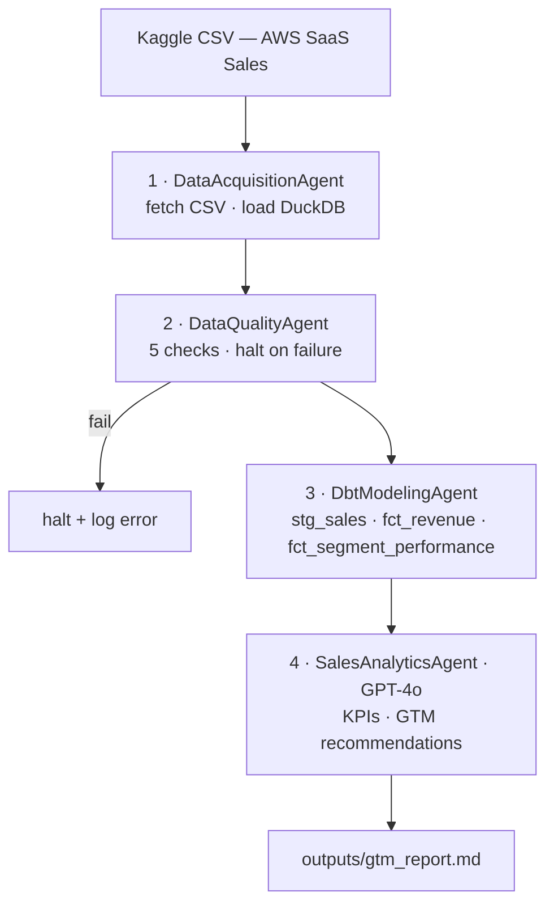

# Autonomous Sales Data Platform

Agentic pipeline that fetches B2B SaaS sales data, validates it, models it with dbt, and generates GTM recommendations using GPT-4o. Built to demonstrate senior data engineering and analytics engineering skills.

---

## What it does

Most GTM analytics teams spend more time pulling and cleaning data than actually analyzing it. This pipeline automates the full journey — from raw CSV to a markdown report a VP Sales can read — using four agents that run sequentially and fail loudly if anything goes wrong.

---

## Pipeline



LLM is used only in Agent 4. Agents 1–3 are pure engineering — deterministic, no AI. That's intentional.

---

## Tech stack

| Layer | Tool |
|---|---|
| Orchestration | OpenAI Agents SDK |
| Warehouse | DuckDB (simulates Snowflake) |
| Data modeling | dbt-duckdb (dbt-core 1.8) |
| Data quality | pandas SQL checks |
| LLM | GPT-4o via Chat Completions |
| Language | Python 3.11 |
| Package manager | uv |

---

## Project structure

```
autonomous-sales-data-platform/
├── agents/
│   ├── data_acquisition_agent.py
│   ├── data_quality_agent.py
│   ├── dbt_modeling_agent.py
│   └── sales_analytics_agent.py
├── dbt_project/
│   ├── models/
│   │   ├── staging/stg_sales.sql
│   │   └── mart/fct_revenue.sql
│   │        mart/fct_segment_performance.sql
│   ├── dbt_project.yml
│   └── profiles.yml
├── data/
│   └── sample_data.csv
├── outputs/
│   └── sample_report.md
├── company_config.yaml
├── main.py
└── requirements.txt
```

---

## Getting started

**Prerequisites:** Python 3.11, uv, a Kaggle API token, an OpenAI API key.

```bash
# Clone and install
git clone https://github.com/priyankpatel/gtm-sales-analytics-ai-platform
cd autonomous-sales-data-platform
uv sync

# Set environment variables
cp .env.example .env
# Add KAGGLE_USERNAME, KAGGLE_KEY, OPENAI_API_KEY to .env

# Run the full pipeline
python main.py
```

The pipeline downloads the dataset automatically on first run if the CSV is not present locally.

---

## Data quality checks

The pipeline halts before modeling if any of these fail:

| Check | Rule |
|---|---|
| Row count | ≥ 1,000 rows |
| Sales column exists | Column present in schema |
| Sales null rate | < 5% |
| Sales positive | No non-null Sales ≤ 0 |
| Segment values | Only: Enterprise, SMB, Strategic |

---

## Output

The final report (`outputs/gtm_report.md`) contains:

- Executive summary
- KPIs: total revenue, profit margin, avg deal size
- Segment performance breakdown
- Top products and regions
- Monthly trend analysis
- 3–5 GTM recommendations written by GPT-4o

---

## Design decisions

**DuckDB instead of Snowflake?** DuckDB runs locally with no infrastructure setup and the dbt-duckdb adapter is a drop-in replacement. The modeling patterns transfer directly to Snowflake.

**Why no LLM in Agents 1–3?** Row counts, null rates, and SQL transformations have deterministic correct answers. Using an LLM there would add cost, latency, and unpredictability with no upside. The LLM earns its place in Agent 4 where the task is interpretation, not computation.

---

## Dataset

[AWS SaaS Sales — Kaggle](https://www.kaggle.com/datasets/nnthanh101/aws-saas-sales) · 9,994 rows · B2B SaaS order data with segment, product, region, sales, and profit columns.
