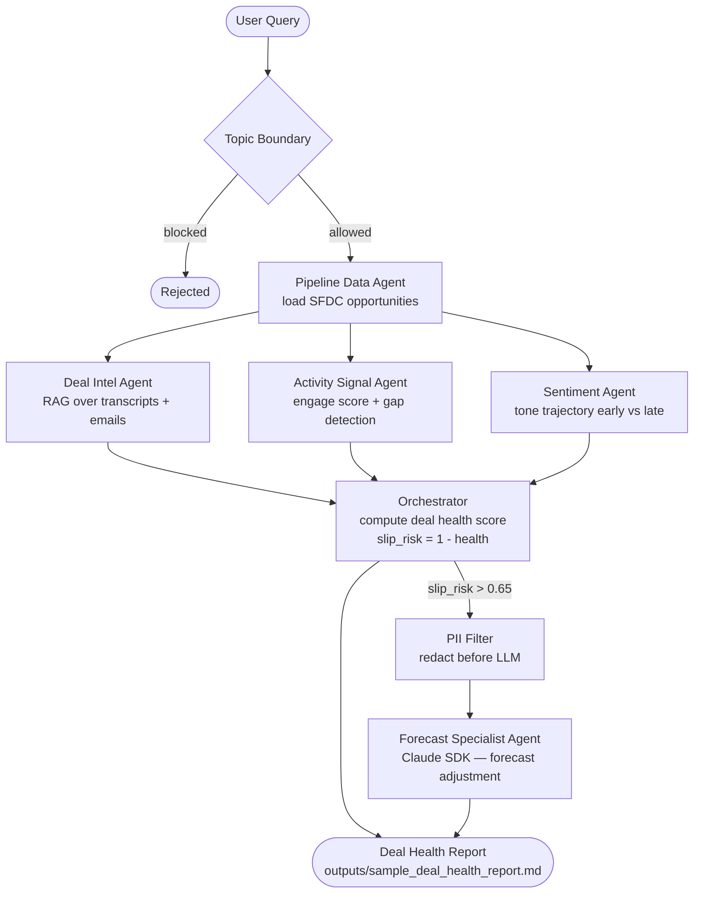

# Pipeline Intelligence System

AI-powered multi-agent pipeline that scores deal health from Salesforce activity,
Gong call transcripts, and email threads. Flags at-risk deals and generates
forecast adjustment recommendations using the Anthropic Claude SDK.

Built as part of a GTM Sales Analytics AI portfolio — one of five projects
spanning different agent frameworks (Claude SDK, LangChain, CrewAI, LangGraph).

---

## How it works



---

## Agents

| Agent | Input | Output |
|---|---|---|
| Pipeline Data Agent | SFDC opportunities CSV | Structured deal list |
| Deal Intel Agent | Gong transcripts + emails (ChromaDB) | RAG context per deal |
| Activity Signal Agent | SFDC activity log | Engagement score 0–1, gap flag |
| Sentiment Agent | Transcripts + emails | Tone trajectory, decline flag |
| Forecast Specialist Agent | Handoff payload from orchestrator | Forecast adjustment (markdown) |

Forecast Specialist only runs when `slip_risk_score > 0.65`. Most deals go through
the health scoring pass only. The threshold is configurable in `company_config.yaml`.

---

## Tech stack

- **Anthropic Claude SDK** — orchestration and forecast generation
- **ChromaDB** (local) — vector store for RAG retrieval
- **sentence-transformers** (`all-MiniLM-L6-v2`) — local embeddings, no API cost
- **pandas** — activity log processing
- **Faker** — synthetic data generation

---

## Setup

```bash
# Install dependencies
pip install -r requirements.txt

# Add your API key
cp .env.example .env
# edit .env — add ANTHROPIC_API_KEY

# Generate synthetic data
python scripts/generate_synthetic_data.py

# Index into ChromaDB
python scripts/index_rag.py

# Run the pipeline
python main.py
# or with a custom query:
python main.py "Review pipeline health for Q3 deals"
```

---

## Sample output

The pipeline scores every loaded deal and writes a report to `outputs/`:

```
| deal_id   | account       | stage    | health | slip | activity_gap | handoff |
|-----------|---------------|----------|--------|------|--------------|---------|
| DEAL-1002 | Santos LLC    | Solution | 0.17   | 0.82 | True         | True    |
| DEAL-1003 | Wolfe LLC     | Proposal | 0.17   | 0.82 | True         | True    |
| DEAL-1004 | Davis Inc     | Proposal | 0.17   | 0.82 | True         | True    |
```

Deals above the slip threshold get a Claude-generated forecast adjustment:

> Push close date by minimum 60 days. Reduce probability to 25–35% until
> champion re-engagement occurs. Do not accept passive legal review as progress.

See [`outputs/sample_deal_health_report.md`](outputs/sample_deal_health_report.md)
for a full example run.

---

## Data

All data is synthetic — generated with Faker, safe for public GitHub.
Slip signals are intentionally seeded into 5 deals: activity gaps > 14 days,
champion contact role going blank, and declining buyer sentiment on the last call.

To use live Salesforce data, set `data_source: sfdc_api` in `company_config.yaml`
and add SFDC credentials to `.env`. The pipeline data layer is source-agnostic.

---

## Project structure

```
pipeline-intelligence/
├── agents/          # 5 agents — one file, one job each
├── orchestrator/    # pipeline_intelligence.py — wires agents + scoring
├── guardrails/      # pii_filter.py + topic_boundary.py
├── rag/             # embedder.py + retriever.py (ChromaDB)
├── data/sample/     # 5-row snapshots committed to git
├── scripts/         # data generation + RAG indexing
├── outputs/         # deal health report written here at runtime
├── company_config.yaml
└── main.py
```

---

*Part of the [gtm-sales-analytics-ai-platform](../README.md) portfolio.*
